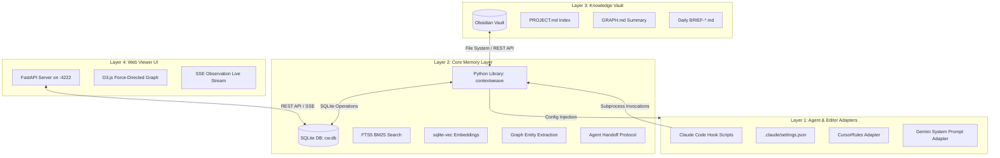

#  ContextWeave: The Agentic Memory Layer

> Persistent SQLite Memory & Brutalist Knowledge Graphs for AI Coding Agents.

ContextWeave solves the "context window amnesia" problem when working with AI coding assistants. Instead of repeatedly explaining your project, architectural decisions, and current state to different agents (Claude, ChatGPT, Gemini), ContextWeave captures, compresses, and injects your project's context automatically using a local SQLite database as a long-term knowledge graph.

---

## 1. Executive Summary
Modern AI development is plagued by context fragmentation. Every new session with Claude, Gemini, or ChatGPT starts at zero knowledge. ContextWeave eliminates this "context tax" by treating memory as a structured knowledge graph stored in a local SQLite database and mirrored as standard Markdown files in your Obsidian vault.

By automating the flow of information between tool uses, agent sessions, and architectural decisions, ContextWeave ensures that AI agents function as continuous collaborators rather than transient assistants.

---

## 2. Key Features

*   **SQLite Native Storage**: Long-term memory is managed locally at `~/.contextweave/cw.db` using SQLite WAL mode for maximum concurrency and ACID reliability. No heavy database servers or complex setups required.
*   **Hybrid Search Engine**: Combined keyword search (FTS5 BM25) and fast local vector search (using `sqlite-vec` extension and cached `sentence-transformers` `all-MiniLM-L6-v2` embeddings) with a module-level cached lazy loader.
*   **Clinical Brutalist Web Viewer**: Beautiful split-panel UI on port `:4222` with a D3 force-directed knowledge graph, memory stream search, SSE live stream feed, brief summaries, and sessions listing.
*   **MCP Integration**: Fully documented standard stdio FastMCP server exposing 15 developer tools.
*   **Claude Code Hooks**: Event-driven automation for tool uses. Pre/Post Tool use observation, automatic session start/close, failure capturing, and settings registration in `.claude/settings.json`.
*   **Obsidian Vault Sync**: Real-time folder hierarchy sync (using `watch` command or manually via `export`) mapping projects, index pages, graphs, and daily briefs.
*   **Local-first privacy**: Completely offline operations for search, indexing, and embeddings (Ollama optional for text summaries).

---

## 3. System Architecture

ContextWeave operates on a 4-layer architecture, connecting your local environment to the AI agents you use daily.



### 3.1 Data Flow Visualization


### 3.2 System Design


---

## 4. Core v2 Components

### 4.1 Hybrid Memory Layer (`db.py` & `memory.py`)
The memory layer manages observations and consolidated memories:
*   **`sqlite-vec` & `FTS5`**: Keeps keyword search and vector embeddings in sync inside SQLite.
*   **Lazy Transformer Loading**: `sentence-transformers` models are loaded on-demand and cached in a module-level variable to minimize initialization latency.
*   **Similarity-based Consolidation**: Dedupes duplicate observations and decays old memories using a localized cosine-similarity matrix, keeping the context block dense and relevant without invoking LLMs.

### 4.2 Web Viewer (`viewer/app.py` & `index.html`)
Redesigned with a raw **Brutalist Terminal Intelligence** theme (JetBrains Mono for monospaced data, IBM Plex Sans for prose).
*   **Split-Panel Layout**: The screen displays a project status dashboard, daily brief, and sessions list on the left; a D3.js force-directed graph (60% height) and a live-updating memory stream (40% height) on the right.
*   **SSE Stream**: Displays live agent actions and observes new memories instantly with custom `▶ NEW` CSS animations.
*   **Node Detail Popup**: Clicking any D3 node displays details alongside the top 3 relevant memories retrieved using local vector query.

### 4.3 Claude Code Hook Automation (`hooks.py`)
Hooks run silently inside Claude Code shell commands:
*   **Event Hooks**: Maps native event commands such as `SessionStart`, `PreToolUse`, `PostToolUse`, `PostToolFailure`, `SubagentStart`, `SubagentStop`, `Stop`, `SessionEnd`, and `PreCompact`.
*   **Claude settings**: Configures hook scripts in `.claude/settings.json` mapping keys to arrays of command strings.
*   **Graceful Execution**: Subprocess commands capture stdout/stderr and run inside try-except blocks, failing silently to avoid disrupting developer workflows.

---

## 5. Installation & Setup

### 5.1 Prerequisites
*   **Python 3.11+**
*   **uv** (recommended package installer)
*   **Ollama** (optional, for LLM-based chat summaries)

### 5.2 Quick Setup
Clone the repository and run the setup scripts:

```bash
# Clone
git clone https://github.com/your-username/contextweave.git
cd contextweave

# Run bootstrap (installs dependencies via uv and registers project)
./setup.sh      # on Linux/macOS
# OR
setup.bat       # on Windows
```

Alternatively, install in editable mode:
```bash
pip install -e .
```

---

## 6. Workflow Quickstart

1.  **Doctor Check**: Verify dependencies are installed and extensions load correctly:
    ```bash
    contextweave doctor
    ```
2.  **Initialize Project**: Initialize a project slug and optionally point to an Obsidian vault:
    ```bash
    contextweave init audit-project --vault ~/Documents/ObsidianVault
    ```
3.  **Start Watching**: Sync changes automatically from the database to your Obsidian vault in real-time:
    ```bash
    contextweave watch audit-project
    ```
4.  **Track Agent Work**:
    *   Start session: `contextweave session start audit-project --agent claude --feature auth`
    *   Record notes: `contextweave observe audit-project "decided to use PostgreSQL over SQLite for sessions"`
    *   Close session: `contextweave session close audit-project --summary "completed login" --next "add refresh tokens"`
5.  **Inject Configs**: Auto-inject active context into `CLAUDE.md`, `.cursorrules`, or custom prompts:
    ```bash
    contextweave inject audit-project --adapter all
    ```
6.  **Install Hooks**: Automatically index your development tool history:
    ```bash
    contextweave hooks install audit-project
    ```
7.  **Serve Graph Viewer**: Open a live D3 graph and memory timeline on port 4222:
    ```bash
    contextweave serve
    ```

---

## 7. CLI Command Reference

| Command | Usage | Description |
|---|---|---|
| `init` | `contextweave init <slug> [--vault <path>]` | Scaffolds a new project. |
| `status` | `contextweave status <slug>` | Dashboard showing sessions, memories, DB size, and health. |
| `watch` | `contextweave watch <slug>` | Background daemon syncing SQLite DB changes to Obsidian. |
| `brief` | `contextweave brief <slug>` | Formats a daily project status brief. |
| `observe` | `contextweave observe <slug> <content>` | Records an observation in the memory layer. |
| `search` | `contextweave search <slug> <query>` | Hybrid BM25 + Vector search query. |
| `session start` | `contextweave session start <slug> --agent <name> --feature <feat>` | Begins tracking agent progress and displays previous handoffs. |
| `session close` | `contextweave session close <slug> --summary <sum> --next <next>` | Concludes a session and generates handoff details. |
| `handoff show` | `contextweave handoff show <slug>` | Displays the latest agent handoff notes. |
| `inject` | `contextweave inject <slug> [--adapter <name>]` | Updates `CLAUDE.md`, `.cursorrules`, etc. with latest memories. |
| `hooks install` | `contextweave hooks install <slug> [--all-agents]` | Installs script files in `.claude/hooks/` and updates settings. |
| `consolidate` | `contextweave consolidate <slug>` | Deduplicates and decays memories, pruning orphan nodes. |
| `export` | `contextweave export <slug>` | Exports current project memories directly to Obsidian. |
| `graph` | `contextweave graph <slug> [--entity <name>]` | Renders a text-based ASCII knowledge graph dashboard. |
| `import-claude`| `contextweave import-claude <slug>` | Imports history from `~/.claude/projects/` JSONL logs. |
| `serve` | `contextweave serve [--port <port>]` | Starts the local FastAPI Brutalist terminal web viewer. |
| `mcp` | `contextweave mcp` | Starts the stdio FastMCP server. |
| `doctor` | `contextweave doctor` | Performs environment diagnostics. |

---

## 8. Obsidian Vault Structure

If a vault path is configured, memories are synced to the following folder structure:
```text
MyObsidianVault/
└── projects/
    └── audit-project/
        ├── PROJECT.md          # Index containing wikilinks to all memories & recent sessions
        ├── GRAPH.md            # Markdown summary listing top knowledge graph entities
        ├── BRIEF-2026-05-22.md # Collated daily brief documents
        └── memories/
            ├── 1.md            # Individual memory documents with YAML metadata
            ├── 2.md
            └── 3.md
```

---

## 9. MCP Tool Interface

Exposes 15 developer-oriented tools via the stdio protocol. Register in `~/.claude.json` or `.cursorrules`:

```json
{
  "mcpServers": {
    "contextweave": {
      "command": "contextweave-mcp",
      "env": {
        "CONTEXTWEAVE_PROJECT": "audit-project"
      }
    }
  }
}
```

| Tool Name | Arguments | Description |
|---|---|---|
| `memory_observe` | `project`, `content`, `source`, `agent`, `tags` | Saves a new observation. |
| `memory_search` | `project`, `query`, `top_k` | Searches SQLite with hybrid ranking. |
| `memory_build_context`| `project`, `query`, `max_chars` | Generates text prompt containing memories and handoffs. |
| `memory_save` | `project`, `content`, `confidence` | Explicitly records high-confidence memories. |
| `memory_session_start`| `project`, `agent`, `feature` | Begins a session and gets session ID. |
| `memory_session_close`| `project`, `session_id`, `summary`, `next_task` | Closes session and triggers decay sweep. |
| `memory_sessions` | `project`, `limit` | Lists project sessions. |
| `memory_handoff_read` | `project` | Returns the latest handoff text. |
| `memory_inject` | `project`, `adapter` | Inject context files (`CLAUDE.md`, etc.). |
| `memory_consolidate` | `project` | Triggers a cleanup sweep. |
| `memory_status` | `project` | Returns statistics in JSON format. |
| `memory_graph_query` | `project`, `entity`, `depth` | Queries knowledge graph nodes. |
| `memory_export` | `project` | Exports memories to Obsidian. |
| `memory_import_claude`| `project` | Imports JSONL files from Claude Code directory. |
| `memory_brief` | `project` | Returns daily project brief. |

---

## 10. agentmemory Comparison

| Feature | `agentmemory` | `contextweave` |
|---------|-------------|--------------|
| **Core Storage** | JSON files on disk | SQLite database (ACID, WAL, FTS5) |
| **Language** | Node.js / TypeScript | Python (ML ecosystem native) |
| **Embeddings** | `@xenova/transformers` | `sentence-transformers` (cached loader) |
| **Search Mechanics** | BM25 + Vector + Graph | Dual FTS5 (BM25) & Vector (`sqlite-vec`) |
| **Handoffs** | Manual CLI injection | First-class lifecycle automation |
| **Vault Syncing** | Simple file appends | Automated structure, indexes, & graphs |
| **Web UI** | Basic viewer | D3 force graph & SSE Live terminal |

---

## 11. Bibliography
*   **Git Context Controller (GCC)** (*arXiv:2508.00031*): Applying COMMIT/BRANCH/MERGE concepts to agent memory.
*   **SAMEP Protocol** (*arXiv:2507.10562*): Standards for multi-agent memory sharing.
*   **Collaborative Memory** (*arXiv:2505.18279*): Tiered memory architectures (private vs. shared).

---

## Contributing
We welcome contributions! Please see our [Contributing Guide](CONTRIBUTING.md) for details on how to add new adapters or improve the retrieval engine.

## License
MIT License - See [LICENSE](LICENSE) for details.
