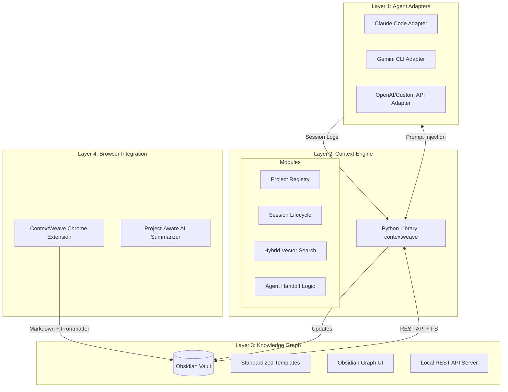

#  ContextWeave: The Agentic Memory Layer

> AI context persistence for multi-model developer workflows, anchored in an Obsidian vault and extended into the browser.

ContextWeave solves the "context window amnesia" problem when working with AI coding assistants. Instead of repeatedly explaining your project, architectural decisions, and current state to different agents (Claude, ChatGPT, Gemini), ContextWeave captures, compresses, and injects your project's context automatically using a local Obsidian vault as a long-term knowledge graph.

---

## 1. Executive Summary
Modern AI development is plagued by context fragmentation. Every new session with Claude, Gemini, or ChatGPT starts at zero knowledge. ContextWeave eliminates this "context tax" by treating memory as a structured knowledge graph stored in a local Obsidian vault.  

By automating the flow of information between web research, agent sessions, and architectural decisions, ContextWeave ensures that AI agents function as continuous collaborators rather than transient assistants.

## 2. Market Landscape and Differentiation
*   **Model-Agnosticism:** Works with any LLM via CLI or extension. Supports Claude Code, ChatGPT, Gemini Web, and more.
*   **Workflow Integration:** Connects the browser (research), the terminal (execution), and Obsidian (knowledge).
*   **Human-Readable Memory:** Every "memory" is a Markdown file you can read, edit, and link manually.
*   **Agent Handoffs:** Explicit protocol for agents to leave instructions for the next agent, ensuring continuity in multi-step engineering tasks.

---

## 3. System Architecture

ContextWeave operates on a 4-layer architecture, connecting your local environment to the AI agents you use daily.



### 3.1 Data Flow Visualization


### 3.2 System Design


---

## 4. Core Components

### 4.1 The Context Engine (`contextweave`)
The heart of the system, written in Python, managing the lifecycle of project context.
*   **`vault`**: A dual-access layer interface. It communicates via the Obsidian Local REST API for web-based tools and direct file system access for CLI performance.
*   **`retrieval`**: Implements local vector search using `ChromaDB`. It embeds your notes using `all-MiniLM-L6-v2`, allowing agents to query your entire vault for relevant architectural patterns or previous decisions.
*   **`session`**: Manages the "active" state of a project. It tracks which agent is working on which feature and ensures logs are saved with rich frontmatter.

### 4.2 The Handoff Protocol
A first-class Markdown schema that captures the "baton" between sessions.
*   **Task State:** Current progress and blockers.
*   **Logic Patterns:** Established coding conventions for the current feature.
*   **Next Steps:** Concrete instructions for the next agent to follow.

### 4.3 Chrome Extension (The Web Clipper)
A project-aware extension that bridges the gap between web research and your knowledge graph.
*   **Capture & Compress:** Scrapes AI chat transcripts and uses local Ollama models to compress them into technical summaries.
*   **Smart Clipping:** Uses Mozilla Readability and Turndown to save clean Markdown versions of docs, auto-tagged to your active project.
*   **Banner Injection:** Detects when you open a new AI chat and offers a one-click "Inject Context" banner.

---

## 5. Advanced Features

### 5.1 Real-Time File Watcher
Run `contextweave watch` to keep your vector database in sync. Every time you save a note in Obsidian or an AI agent writes a session log, ContextWeave auto-indexes the change within 2 seconds. No manual indexing required.

### 5.2 Daily Brief Generator
Every morning, run `contextweave brief` to get a summary of all AI activity across your projects from the last 24 hours. It highlights:
- What features were touched.
- Which agents performed the work.
- **Open Questions** that require your human intervention.
- The exact "Next Step" for your first session of the day.

### 5.3 Context Diffs
Curious what changed since you last worked on a feature? `contextweave diff` produces a summarized delta between the last two sessions, highlighting new decisions and newly modified files.

---

## 6. Installation & Setup

### 6.1 Prerequisites
- **Python 3.11+**
- **Ollama**: Install from [ollama.com](https://ollama.com). Run `ollama pull mistral`.
- **Obsidian**: Install the [Local REST API plugin](https://github.com/coddingtonbear/obsidian-local-rest-api).

### 6.2 Quick Install
```bash
git clone https://github.com/your-username/contextweave.git
cd contextweave
./scripts/install.sh
```
The installer will check your environment, pull necessary models, and help you configure your vault path.

---

## 7. Workflow Quickstart

1.  **Check Health**: `contextweave doctor` (Ensure Ollama and Obsidian are reachable).
2.  **Initialize**: `contextweave init my-project` (Creates the folder structure in Obsidian).
3.  **Start Watching**: Open a terminal and run `contextweave watch my-project`.
4.  **Work with AI**: 
    - `contextweave session start my-project --agent claude --feature "auth-api"`
    - `contextweave inject my-project --adapter claude`
5.  **Research**: Use the Chrome Extension to clip relevant API docs into your vault.
6.  **Handoff**: `contextweave session close my-project --summary "implemented JWT" --next "test with frontend"`

---

## 8. CLI Command Reference

| Command | Usage | Description |
|---|---|---|
| `init` | `contextweave init <slug>` | Scaffolds a new project in your vault. |
| `status` | `contextweave status <slug>` | Dashboard showing last session, next steps, and health. |
| `watch` | `contextweave watch [slug]` | Background process to auto-sync notes to vector DB. |
| `brief` | `contextweave brief [--all]` | Generates a daily AI activity summary. |
| `diff` | `contextweave diff <slug>` | Shows what changed between the last two sessions. |
| `session start` | `contextweave session start <slug>` | Begins a new tracked session. |
| `session close` | `contextweave session close <slug>` | Finalizes session and generates handoff notes. |
| `inject` | `contextweave inject <slug>` | Injects context into agent system files (CLAUDE.md). |
| `doctor` | `contextweave doctor` | Self-diagnostic tool for your environment. |

---

## 9. Project Vault Structure
ContextWeave maintains a clean, searchable hierarchy in your vault:
```text
vault/
├── projects/
│   └── [project-slug]/
│       ├── PROJECT.md              # Project dashboard
│       ├── context/
│       │   └── in-progress.md      # Active state
│       ├── sessions/               # All historical logs
│       │   └── 2026-05-19-claude-auth.md
│       ├── agents/                 # Handoff notes and diffs
│       │   └── 2026-05-19-handoff.md
│       └── web-captures/           # Clipped docs
│           └── stripe-docs.md
```

## 10. Privacy & Cost
ContextWeave is **local-first**.
- **Zero API Costs**: Summarization, diffing, and embedding all run locally via Ollama and sentence-transformers.
- **Data Sovereignty**: Your chat logs and research never leave your machine.

---

## 11. Strategic Research Bibliography
The design of ContextWeave is informed by the following research:
1.  **Git Context Controller (GCC)** (arXiv 2508.00031): Applying COMMIT/BRANCH/MERGE concepts to agent memory.
2.  **SAMEP Protocol** (arXiv 2507.10562): Standards for multi-agent memory sharing.
3.  **Collaborative Memory** (arXiv 2505.18279): Tiered memory architectures (private vs. shared).

---

## Contributing
We welcome contributions! Please see our [Contributing Guide](CONTRIBUTING.md) for details on how to add new adapters or improve the retrieval engine.

## License
MIT License - See [LICENSE](LICENSE) for details.
