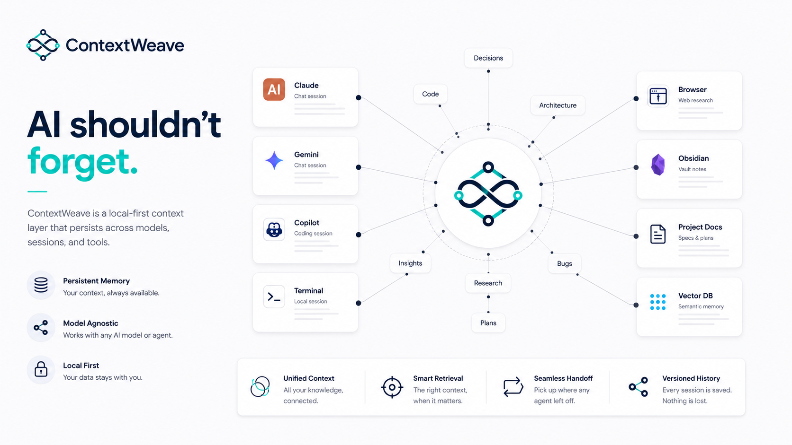
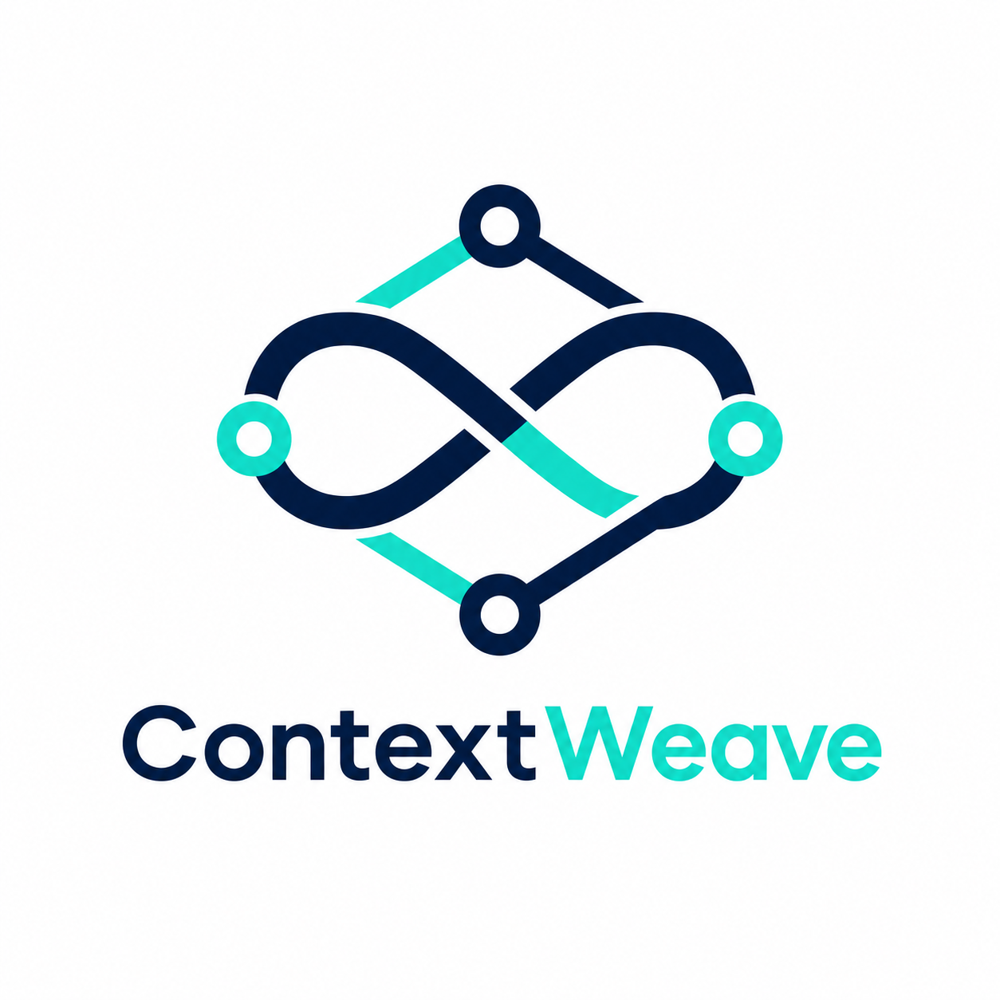
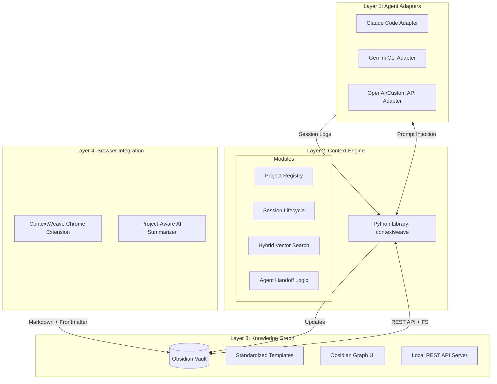
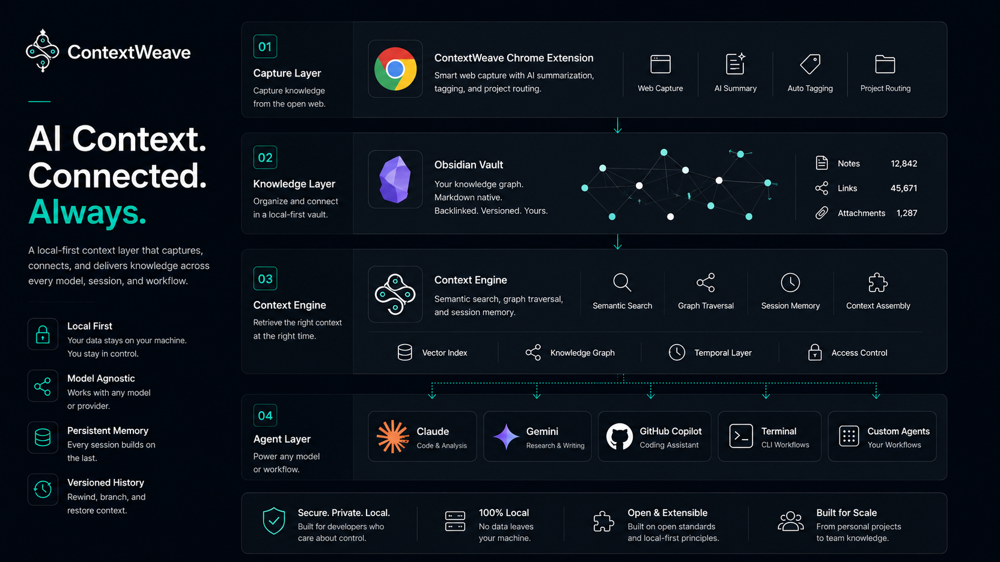

#  ContextWeave: The Agentic Memory Layer

> A local-first, model-agnostic context persistence layer for multi-agent AI workflows, anchored in an Obsidian vault and extended into the browser.

ContextWeave is a production-grade infrastructure layer designed to solve the "Amnesia Problem" in AI-assisted engineering. It provides a persistent knowledge graph that follows the developer across every model, session, and tool in their stack.

---

## 1. Executive Summary

Modern AI development is plagued by context fragmentation. Every new session with Claude, Gemini, or Copilot starts at zero knowledge. ContextWeave eliminates this "context tax" by treating memory as a structured knowledge graph stored in a local Obsidian vault. 

By automating the flow of information between web research, agent sessions, and architectural decisions, ContextWeave ensures that AI agents function as continuous collaborators rather than transient assistants.

---

## 2. Market Landscape and Differentiation

### 2.1 Existing Solutions
*   **MemGPT / MemOS:** Treat memory as an OS abstraction (paging/retrieval) but are often model-specific and lack local workflow integration.
*   **Amazon Bedrock AgentCore:** Cloud-managed memory that creates vendor lock-in and lacks local-first privacy.
*   **Obsilo / SystemSculpt:** Mature Obsidian-native AI tools that are vault-internal only and do not solve the cross-tool/cross-model sharing problem.
*   **MCP (Model Context Protocol):** An integration standard. ContextWeave sits *on top* of MCP, using it as a delivery mechanism for the context stored in the vault.

### 2.2 The ContextWeave Advantage
ContextWeave is unique in its combination of:
*   **Model-Agnosticism:** Works with any LLM via CLI or API.
*   **Workflow Integration:** Connects the browser (research), the terminal (execution), and Obsidian (knowledge).
*   **Human-Readable Memory:** Every "memory" is a Markdown file you can read, edit, and link manually.
*   **Agent Handoffs:** Explicit protocol for agents to leave instructions for the next agent.

---

## 3. System Architecture

ContextWeave is organized into four distinct layers.



### 3.1 Data Flow Visualization


### 3.2 System Design


---

## 4. The Knowledge Graph (Vault Structure)

The Obsidian vault serves as both the database and the user interface.

```text
vault/
├── projects/
│   └── [project-slug]/
│       ├── PROJECT.md              # Project dashboard and status
│       ├── context/
│       │   ├── architecture.md     # High-level system design
│       │   ├── decisions.md        # Architecture Decision Records (ADR)
│       │   ├── in-progress.md      # Active tasks and blockages
│       │   └── gotchas.md          # Anti-patterns and lessons learned
│       ├── sessions/
│       │   ├── 2026-05-18-claude-auth.md
│       │   └── 2026-05-19-gemini-db.md
│       ├── web-captures/
│       │   └── stripe-docs-auth.md
│       └── agents/
│           ├── handoff-notes.md    # Handoff queue
│           ├── open-loops.md       # Cross-session questions
│           └── identities/         # Agent-specific performance logs
├── _templates/                     # Templates for consistency
└── _index.md                       # Global project registry
```

---

## 5. Core Components

### 5.1 The Context Engine (`contextweave`)
A Python-based library that manages the flow of context.
*   **`contextweave.vault`**: Handles dual-path access (Local REST API + Direct File System).
*   **`contextweave.retrieval`**: Implements tiered loading. Loads summaries and titles first to save tokens, fetching full content only when semantic relevance exceeds a threshold.
*   **`contextweave.handoff`**: Manages the "relay race." It ensures that when you switch from Claude to Gemini, the new model receives a "last known state" summary.

### 5.2 The Handoff Protocol
A first-class Markdown schema that captures:
*   **Task State:** What was being worked on when the session ended.
*   **Logic Patterns:** Specific coding patterns established (e.g., "Use the wrapper in `src/lib/jwt.ts` instead of the raw library").
*   **Unresolved Anomalies:** Strange behaviors or bugs discovered but not yet fixed.

### 5.3 Chrome Extension (Clipper)
Unlike generic clippers, the ContextWeave extension is **project-aware**.
*   **Routing:** Detects active projects based on URL (e.g., your GitHub repo) and saves clips to the correct vault folder.
*   **Summarization:** Uses the active project's architecture notes to summarize web pages relative to your current goals.

---

## 6. Advanced Novel Features

### 6.1 Agent Identity Cards
Each model gets a profile in the vault tracking its strengths, weaknesses, and total sessions. This allows you to see at a glance which model is the "expert" on a particular feature.

### 6.2 Context Budget Awareness
Before starting a session, the engine calculates the token cost of the requested context and offers tiered modes:
*   **Nano:** ~500 tokens (Last handoff + current status).
*   **Micro:** ~2000 tokens (Nano + architecture summary).
*   **Deep:** ~20000+ tokens (Full project history for long-context models).

### 6.3 Daily Brief Generator
Every morning, ContextWeave generates a summary of all AI work performed the previous day, highlighting open questions that require human intervention.

### 6.4 Codebase Snapshotting
Generates high-level Markdown descriptions of the directory structure and critical files using `tree-sitter`, allowing agents to orient themselves without expensive filesystem crawls.

---

## 7. Development Roadmap

### Phase 1: Core Foundation (Current)
*   [x] Vault directory structure and templates.
*   [ ] Vault file system interface (Python).
*   [ ] Basic CLI for session initialization.
*   [ ] Claude Code adapter (CLAUDE.md management).

### Phase 2: Intelligence and Retrieval
*   [ ] Local embedding engine (sentence-transformers).
*   [ ] Tiered loading logic implementation.
*   [ ] Hybrid (BM25 + Vector) search.

### Phase 3: Integration
*   [ ] Chrome Extension development.
*   [ ] Gemini and Copilot adapters.
*   [ ] Conflict resolution for multi-agent writes.

---

## 8. Technical Stack

| Component | Technology |
|---|---|
| Core Logic | Python 3.11+ |
| Persistence | Markdown + YAML Frontmatter |
| UI/Graph | Obsidian |
| Embeddings | all-MiniLM-L6-v2 (Local) |
| Code Parsing | tree-sitter |
| Extension | Manifest V3 / TypeScript |

---

## 9. Strategic Research Bibliography

The design of ContextWeave is informed by the following research:
1.  **Git Context Controller (GCC)** (arXiv 2508.00031): Applying COMMIT/BRANCH/MERGE concepts to agent memory.
2.  **SAMEP Protocol** (arXiv 2507.10562): Standards for multi-agent memory sharing.
3.  **Collaborative Memory** (arXiv 2505.18279): Tiered memory architectures (private vs. shared).

---

## 10. Getting Started

1.  **Vault Setup:** Open the `contextweave` folder in Obsidian.
2.  **Enable Plugins:** Install and enable the **Local REST API** plugin in Obsidian.
3.  **CLI Setup:** `uv run contextweave init` to configure your vault.

---
*ContextWeave: Building a continuous intelligence layer for the modern developer.*
